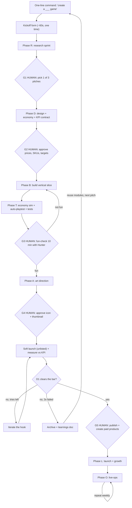
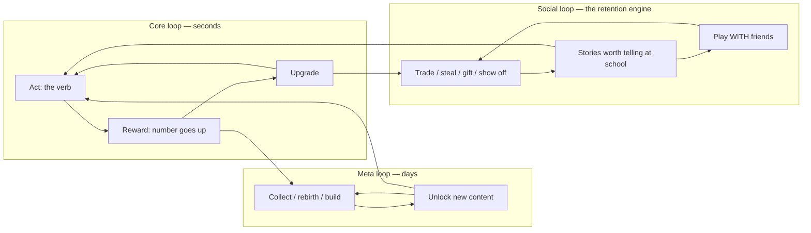
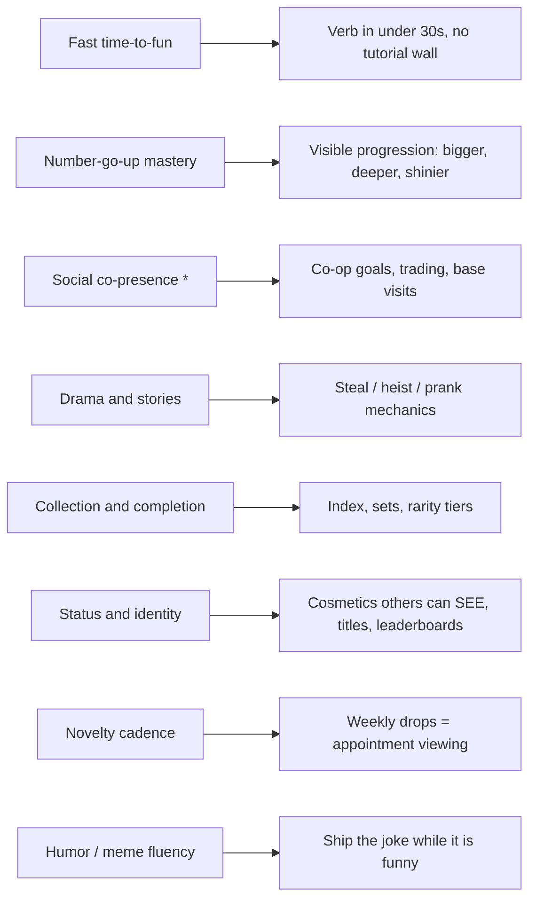
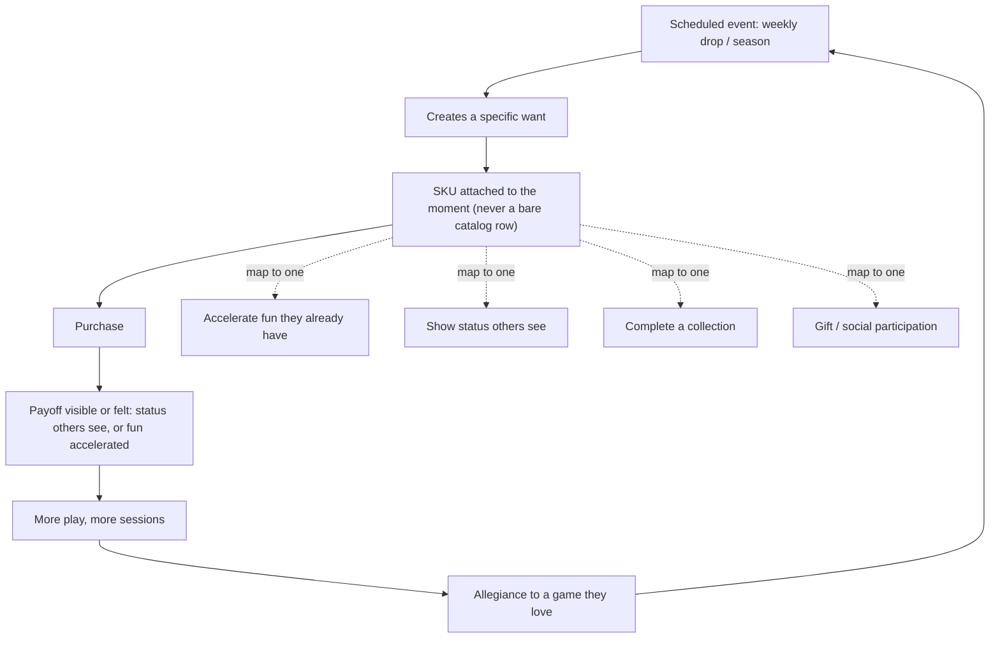
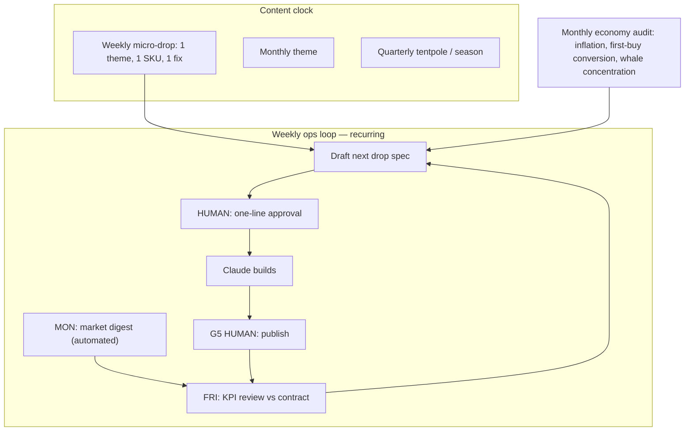
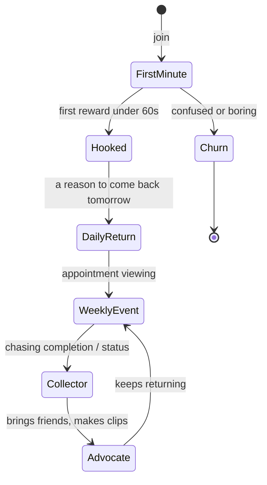
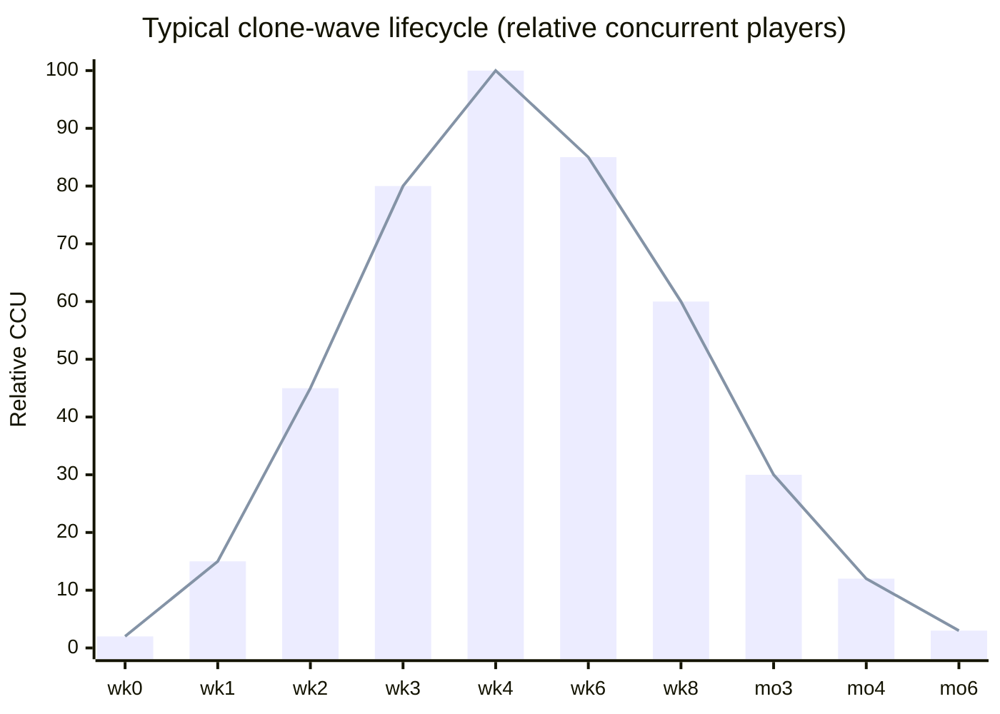
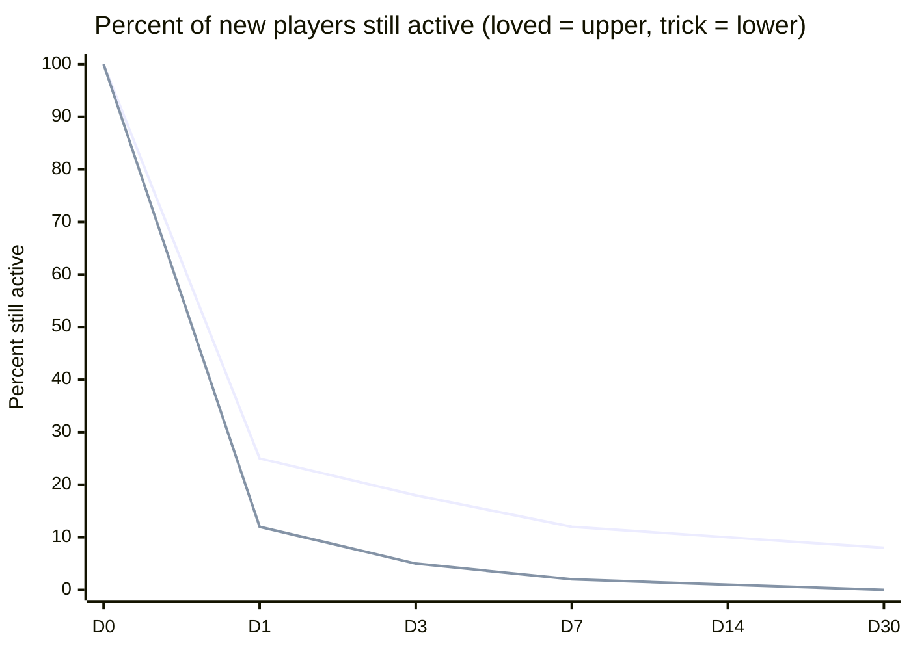
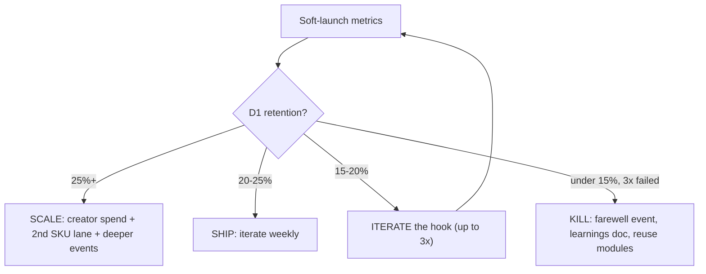
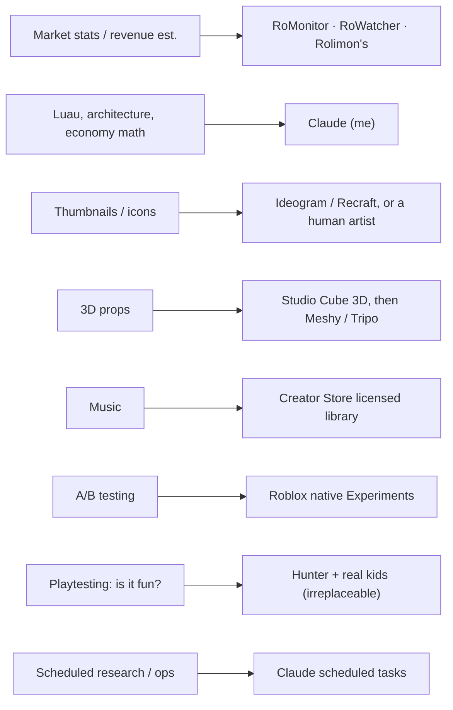

# System Map — Roblox Game Pipeline

Visual model of the pipeline's recurring logic: the loops, flows, and charts behind PIPELINE.md.
This is the source of truth for the diagrams; open `system-map.html` to see them rendered.
Fenced `mermaid` blocks render automatically on GitHub and in VS Code (Markdown Preview Mermaid extension).

## 1 · Master pipeline — command to ship

The whole machine. One line in at the top; a live game at the bottom. Diamonds are the 5 human gates — the only places that stop for you. Everything else runs on stated defaults. Two loop-backs: the fun-check bounces to rebuild, and a game that can't clear D1 gets killed and feeds the next pitch.

## 2 · The three nested loops — the retention engine

Every game we build is these three loops stacked. The core loop is the second-to-second fun. The meta loop is the reason to come back tomorrow. The social loop is the retention engine — it's what turned Steal a Brainrot into 25M concurrent players. If a pitch can't fill all three boxes, it won't retain.

## 3 · Player psychology → the system that serves it

Left column is why a kid plays; right column is the feature we build for it. We never build a system that doesn't answer a real driver, and we never leave a driver unserved. Social co-presence is starred because Roblox's own discovery tracks co-play, and it's the single strongest retention driver on the platform.

## 4 · The monetization 'why' loop — your core thesis

Your instinct, drawn as a loop: kids don't buy a bare catalog row, they buy into a moment. The event creates a specific want, the SKU attaches to that want, and the payoff has to be visible to others or felt in play — that's what earns the next purchase. Every SKU is classified against one of four drivers; if it maps to none, it doesn't ship.

## 5 · Live-ops heartbeat — the recurring automation loop

This is the part that runs forever after launch and is where the money actually is. The weekly loop is already half-automated: my Monday market digest is live now; once a game ships, Friday KPI review → draft next drop → your one-line yes → I build → you publish becomes the recurring cycle. The content clock (weekly/monthly/quarterly) sets the theme; the monthly economy audit feeds the drops.

## 6 · Player lifecycle — where players are won or lost

The states a player moves through, and the two exits. The first minute is the whole ballgame: reach the first reward in under 60 seconds or they churn. Every retention system exists to push a player one state to the right — toward Advocate, the player who brings friends and makes the clips that grow the game for free.

## 7 · Clone-wave timing — when to enter, when to run

The chart you need before committing to a genre. Meme/clone waves rise in WEEKS and fade in MONTHS (Steal a Fish: 0 → 192K CCU peak → hundreds, inside a few months). Enter weeks 0–3 while it's climbing, harvest through week 8, and be out or diversified before month 3. Entering a wave in month 3 is building on a graveyard. Speed is the moat.

## 8 · Retention decay — loved game vs. trick game

Why the fair-play stance is the winning strategy, in one chart. Top curve is a game people love (gentle decay, a durable base). Bottom curve is a game that wins the first click with a trick and bleeds out (Roblox's June 2026 discovery rework actively devalues this pattern). The area between the curves is the entire business. We build the top curve.

## 9 · Kill-or-scale decision — the portfolio gate

The unemotional rule that keeps us fast. Soft-launch D1 decides the game's fate. Above 25%, pour fuel on it. Below 15% after three honest hook rewrites, kill it the same week — farewell event, write the learnings, reuse the code modules on the next pitch. A fast funeral is a win: it's what frees us to catch the next wave.

## 10 · Tool routing — who does each job best

Your standing rule made concrete: the best tool wins, not Claude by default. I own architecture, Luau, and economy math. Everything else routes to whoever is better — trackers for market data, the platform's own A/B system for experiments, and Hunter plus real kids for the one thing no AI can do: tell us if it's actually fun.

