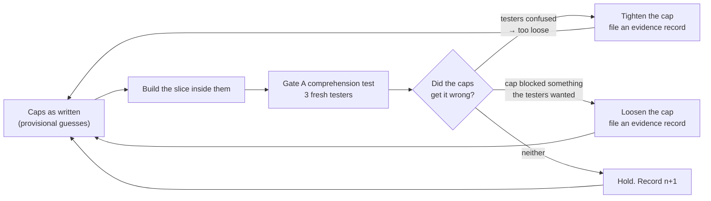

# The complexity budget

> **Governed by `docs/ROBLOX_SUCCESS_LOGIC.md` (standing orders).** If this file fights that file, that file wins.
> Canonical home for the caps. `docs/SYSTEM_ARCHITECTURE.md` §3 explains why they exist; this file is what they *are*.

**Status: DEFAULTS WITH AN EXPIRY.** Not law. Not Justin's judgment. They expire at the first Gate A comprehension test and are then moved by evidence.

## The caps

| Slot | First slice allows | Why this number |
|---|---|---|
| Core verb | 1 | The one thing the player does second to second |
| Return hook | 1 | Doctrine §4.5 — one, implemented well |
| Social / clip hook | ≤ 1 | The thing a twelve-year-old films |
| Player-facing systems | ≤ 4 | Shop, upgrade, zone, collection — count them |
| On-screen numbers | ≤ 3 | A fourth counter is where the HUD stops being readable |
| Onboarding artifact | 1, required | See `skills/playtest-comprehension.md` |

## Why these are not Justin's to own

They were put to Justin as a decision, and that was a category error. He said plainly he does not supply generative taste — and **a cap is a generative taste judgment wearing a number's clothing.** "Four systems" is not a measurement of anything; it is a guess about legibility. Asking the owner to ratify a guess produces a guess with his signature on it, which is worse than an unsigned guess because it is now hard to change.

## The expiry — how they actually get set

Nobody has to be right today. **The first comprehension test settles it**, and every one after that moves it.

**Every Gate A asks two questions about the budget itself**, and the answers are filed as evidence records in `evidence/ledger/`:

1. Did a cap **block** something the slice needed? → candidate to loosen
2. Did testers get confused **inside** the caps? → the cap was too loose, tighten it

A cap that survives two titles unchanged reaches `n=2` and becomes a real default rather than a provisional one. A cap moved by evidence is the system working, not the system failing.

**Claude may adjust a cap on its own** when a Gate A result justifies it, because that is the "raise a bar the evidence moved" row of the autonomy contract. It logs the change to `evidence/CHANGELOG.md` with the record that caused it.
