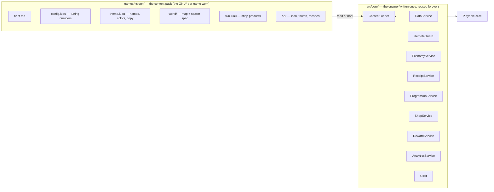
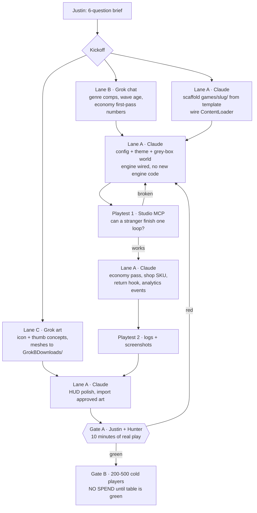

# Game Factory — how "create a ___ game" becomes 2 hours

> **Governed by `docs/ROBLOX_SUCCESS_LOGIC.md` (standing orders).** If this file fights that file, that file wins.

**The goal:** Justin opens Claude Code, says *"create a ___ game,"* answers six questions, and ~2 hours later has a playable Gate A candidate — a stranger could complete earn → spend → progress without him in voice chat.

**Why that is not possible today:** `src/` contains three one-line stubs. Every run starts from zero, so every run re-derives DataStores, receipt idempotency, remote validation, shop UI and save schemas — slowly, and differently each time. The bottleneck is missing *code*, not missing instructions.

**The fix:** split the repo into an engine that never gets rewritten and a content pack that is the only thing a new game needs.

---

## 1. The two layers

**Rule:** a new game adds files to `games/<slug>/` and changes **nothing** in `src/core/`. The day a new game forces an engine change, that change is made generic and folded back into the engine — it never lives in one game.

### Engine inventory (build order, hardest dependency first)

| # | Module | Owns | Doctrine tie |
|---|---|---|---|
| 1 | `DataService` | DataStore, session locking, schema version + migration, autosave, retry/backoff | §4.3 "data that saves" — the #1 Gate A killer |
| 2 | `RemoteGuard` | Typed remote registry, arg validation, per-player rate limits, fail-closed | §8 never trust the client |
| 3 | `EconomyService` | Balances, earn/spend ledger, all server-side | §8 server-authoritative |
| 4 | `ReceiptService` | Idempotent `ProcessReceipt` + durable receipt ledger | `CLAUDE.md` non-negotiable |
| 5 | `ProgressionService` | Upgrade tiers + curve, driven entirely by `config.luau` | §4.2 readable in first session |
| 6 | `ShopService` | SKU registry, PolicyService region checks, one obvious first product | §4.4 fair first purchase |
| 7 | `RewardService` | The one return hook (daily / timed / friend) — pick one per game | §4.5 reason to return |
| 8 | `AnalyticsService` | Funnel events: join → first earn → first spend → first upgrade → D1 marker | §5 Gate B needs numbers or it is vibes |
| 9 | `UIKit` | HUD, currency counter, toast, shop frame, confirm dialog | §4.6 readable at a glance |
| 10 | `ContentLoader` | Reads the pack, validates it, builds the world | makes packs swappable |

`AnalyticsService` is not optional polish. Gate B is a table of numbers; without instrumentation there is nothing to put in it and the gate silently becomes a guess.

---

## 2. The one input: `GAME_BRIEF`

Six questions, answered once, ~5 minutes. Everything downstream derives from this file.

1. **Loop verb** — mine / collect / steal / build / race / survive
2. **The 2-second hook** — what a clip shows in the first two seconds
3. **Reason to open it tomorrow** — pick exactly one: daily rock, timed drop, friend bonus, streak
4. **Session shape** — snack (3–5 min) or sit-down (15+ min)
5. **Monetization stance** — none / cosmetics only / full fair-play catalog
6. **Art seed** — one reference image, or three adjectives

The brief is written to `games/<slug>/brief.md` before any code. No brief, no build.

---

## 3. Who does what, and what runs in parallel

**Parallelism is on disk and out-of-band, never in Studio.** Grok researches and draws while Claude writes; Claude stays the only writer to `src/` and the live DataModel (doctrine §9). Two agents in Studio at once corrupts the DataModel — that constraint is not negotiable for speed.

---

## 4. The 2-hour clock (once the engine exists)

| Time | What happens | Who |
|---|---|---|
| 0:00–0:05 | Six-question brief → `games/<slug>/brief.md` | Justin |
| 0:05–0:20 | Pack scaffolded from template; research lane runs in parallel | Claude ‖ Grok |
| 0:20–1:00 | `config.luau`, `theme.luau`, grey-box world, engine wired | Claude |
| 1:00–1:20 | **Playtest 1** — one full earn → spend → progress cycle, fix what breaks | Claude + MCP |
| 1:20–1:40 | Economy numbers, first SKU, return hook, analytics events | Claude |
| 1:40–2:00 | **Playtest 2**, HUD pass, screenshots, session log written | Claude + MCP |
| 2:00 | **Gate A candidate.** Grey-box, honest, playable. | Justin + Hunter |

What is **not** in two hours, and should not be pretended into it: final art, a tuned economy, Gate B numbers, publishing. Those follow the doctrine's order and its gates.

---

## 5. Getting from here to there

The engine does not exist yet. Honest estimate, in ~12-minute-review-window sessions:

| Step | Work | Sessions |
|---|---|---|
| 1 | Engine modules 1–4 (data, remotes, economy, receipts) + a spec each | 2 |
| 2 | Engine modules 5–10 (progression, shop, reward, analytics, UI, loader) | 2 |
| 3 | **First game built on it, end to end, to Gate A** — this is what proves the engine | 1–2 |
| 4 | Extract that game's generic parts back into `src/core/`; freeze the template | 1 |

Step 3 is the one that cannot be skipped or simulated. An engine that has never run a real playtest is another document. After step 4, "create a ___ game" is a content pack, and two hours is real.

**Everything above is subordinate to the gates.** A factory that produces Gate-A-candidates fast is the goal; a factory that produces *published* games fast is the anti-pattern the doctrine exists to prevent.
