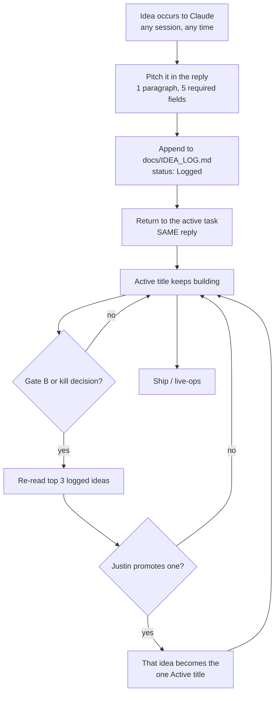

# Success Logic — Standing Orders (read every session)

This file is product doctrine, not lore. If a task fights this file, this file wins.

**Scope: every game this repo builds or rebuilds.** Not one title. Layer Mine is the current active title and appears below only as the worked example; substitute whatever the active title is. Mining terms (ore, sell, upgrade) stand in for that game's earn → spend → progress verbs.

**One active title at a time.** A second game starts only after the human says the current one is done, parked, or killed at a gate.

Claude is the **writer** (Luau, Rojo, Studio MCP). Grok is research / art / second pass. The human owns taste, publish, prices, and spend. None of that is “throw features at the wall.”

---

## 1. What success actually is

Roblox is a **power-law** market.

- Most published experiences earn **$0**.
- Of creators who reach DevEx, the **median** is on the order of **~$1,500 / year**, not a salary.
- A thin slice makes real money. A thinner slice makes $10k+/month.
- Platform payouts in aggregate are large. They are not evenly shared.

**Implication:** shipping a game is not a business plan. Holding players is.

AI (Claude + Grok) makes production cheaper. It also makes **everyone else’s** production cheaper. Extra ores, extra worlds, extra UI kits do not buy attention. Attention is the scarce thing.

---

## 2. Random vs process (the core claim)

Success is **not** a coin flip. It is also **not** a guaranteed recipe.

```
outcome ≈ skill (loop, economy, stability)
        × process (measure → patch → clip → maybe spend)
        × luck (timing, one video, algorithm test)
```

- If skill or process is ~0, luck does not save you.
- If skill and process are decent, luck decides **how high** you go ($200/mo vs $8k/mo), not whether you are default-dead.
- 2026 discovery weights **return over ~28 days** (D1, week-1, week-4, friends, real play-through), not a weekend thumbnail spike.

“Throw shit on the wall” fails because twelve half-games never get a real first session or a week of live-ops. That is bad process labeled as bad luck.

### 2.1 Ideas vs. switching (these are different acts)

**Propose freely. Switch rarely.**

Claude should surface any genuinely good game idea the moment it sees one — current, fun, visually attractive, real shot at working. Never sit on one. Holding back a good idea to look disciplined is itself a failure, and Justin has said so explicitly.

A proposal is **not** a build order. The split:

| Act | Who | When |
|---|---|---|
| Notice + pitch an idea | Claude, unprompted, any time | Immediately, in one paragraph |
| Log it | Claude | Same session, `docs/IDEA_LOG.md` |
| Move idea → active title | **Justin only** | Explicit call |
| Start building a second game | Nobody, ever, without that call | — |

Pitch format (keep it to one paragraph, in `docs/IDEA_LOG.md`):
hook in one sentence → why now → the first-session moment → closest comps → why it is not a clone → what would make it *look* better than the comps.

Then go back to the current task in the same reply. Logging an idea never pauses the active title, forks the repo, or spends a build session.

**Killing** a title is allowed — at a gate, on evidence, with a learnings doc. "Kill fast" never means abandoning mid-build because something newer looks fun. That is the twelve-half-games failure this section is about: not having ideas, but *acting* on each one the week it arrives.

An idea log costs nothing and loses nothing. An unfinished game costs the whole slot.



The only arrow into "Active" starts at Justin. Every other arrow is Claude working.

---

## 3. What “effort” counts

Counts:

- First 10 minutes of play
- Time-to-first-reward / first-sell / first-upgrade (the game's own earn → spend → progress verbs)
- Why a player would open the game **tomorrow**
- Stability (no data loss, no softlock, remotes server-authoritative)
- Fair first purchase
- Watching real sessions and patching what they show
- One short clip of a real hook
- A weekly content drip **after** the slice is playable

Does **not** count (do not spend the session on these unless asked):

- The 40th ore type
- A third world before world one retains
- Cosmetic systems with no loop
- “Fully refined” / feature-complete before anyone has played
- Paid ads or paid YouTubers before benchmarks
- Local LLMs, extra agents, extra hardware
- Building from a blank slate when a working shape already exists (see §3.1)

Default build order: **playable slice → instrument → patch → clip**. Not **complete GDD → then players**.

### 3.1 Copy aggressively (amended by Justin, 2026-09-12)

**Blank slates are slow. Most games in a category look alike because the shape works. Copy the shape, blend the best of the top three, and let the owner cut what he does not want.** The earlier "no scraping or cloning" line is withdrawn; it was protecting speed and it was costing it.

What "copy" means here, so nobody hesitates:

| Copy freely, on sight | Why it is fast |
|---|---|
| Loops, verbs, reward cadence, the first 60 seconds, meta and social loops | Public, observable, the entire point of Phase R |
| Price ladders, product types, event rhythms, what players complain about | Same |
| UI layout, HUD density, camera, colour logic, VFX cadence, silhouette language — the **style** | Observed from public video and the storefront |
| **Creator Store models, textures, audio (free or licensed)** | Legal by construction — this *is* copying existing assets, and Studio MCP inserts them by ID |
| Roblox Assistant / Cube 3D generations, and Meshy / Tripo / Ideogram outputs made *in the style of* the top three | Ours to use |

| Do not, and it is not a taste rule | Why |
|---|---|
| Ripping meshes, textures, audio or scripts out of someone else's place | Not possible through our tools; needs exploit tooling that gets the *account* banned, and the title is deleted the week it starts earning |
| Names, mascots, logos, characters with an owner | Moderation removes on sight; the takedown lands after Gate B (Peter Griffin, 2026-09-11) |
| Roblox private endpoints | Terms-of-service violation → account risk. Trackers and the public storefront give the same numbers legally |

The second table is not doctrine; it is what Roblox and copyright do regardless of what this file says. Everything in the first table is the default, done unprompted, as much of it as possible.

---

## 4. The product bar (ship this, not a museum)

A shippable slice has:

1. One core loop a new player can finish without a tutorial wall
2. Earn → sell → upgrade that is readable in the first session
3. Data that saves
4. A shop with **one** obvious first product that is not a scam
5. A reason to return (daily rock, timed drop, friend bonus — pick one, implement it well)
6. An icon / thumbnail that shows the hook, not a logo soup

“Good enough to market” ≠ “every feature in the doc.” Live-ops is the rest of the game.

---

## 5. Decision gates (do not skip)

### Gate A — Internal playtest

Human + Claude MCP playtest. No spend.

Stop and patch if: load fail, empty shop, client-trusted cash, data wipe, cannot complete one full earn → spend cycle.

### Gate B — Cold players (200–500 new players, not friends)

| Signal | Do not spend money | OK to test small spend |
|---|---|---|
| First session | Most gone in under ~2 min | Median completes the core loop + one spend |
| Play-through | Click → quit on load | They enter the core activity and act |
| D1 return | Under ~8–10% | ~12%+ (grind genres can trail RP; near-0 is death) |
| Sentiment | Dislike pile, no favorites | Favorites up; likes not a joke |
| Organic spend | Zero ever | A few buys with no pleading |
| Stability | Softlocks / data loss | One full session without a ticket |

These are **not** hit-game numbers. They are “ads will not only rent empty visits.”

### Gate C — Paid traffic

Only after Gate B is mostly green.

First paid test = **small Sponsored Experiences on the winning icon only**, capped. If cost-per-play is high **and** those players do not return, kill the campaign. The ad did not fail. The game did.

---

## 6. Marketing sequence (locked)

Do **not** invert this list.

1. Tight playable slice (Gate A)
2. Cold-player proof (Gate B)
3. Short video: TikTok + YouTube Shorts + clip on the experience page (Moments)
4. Micro creators who already play **this game's genre** (5k–50k). Free early access. No $1k YouTuber.
5. Tiny Roblox ads (Gate C) — can sit beside shorts, never instead of a working loop
6. Long-form YouTube last (search / updates). Worst as a launch plan.

Free before Gate B: clips, DMs, testers.  
Paid after Gate B: ads and creator fees.

YouTube is the library. Shorts / TikTok / Moments is the storefront. The product is still the ad.

Hook format for clips: 15–30s, hook in 2s (rare drop, big ore, friend flex). Not a 12-minute tutorial.

---

## 7. Discovery reality (2026)

Homepage / Recommended For You is leaning on **longer-window return**, not raw CCU and not “went viral Saturday.”

- A 200-player community that comes back can beat a 5k CCU bounce house.
- Ads on a bounce house got more expensive, not cheaper.
- Moments is an in-app short-video door. Put a real clip on the experience page.

Claude must not optimize for “peak CCU screenshot.” Optimize for **come back tomorrow**.

---

## 8. Monetization doctrine

- Server-authoritative economy. Never trust the client for ore, cash, or receipts.
- One clear first purchase. Then sinks that keep the loop fun.
- Do not dark-pattern the first session.
- `ProcessReceipt` and DataStores are human-gated. Draft them; do not “publish and pray.”
- No publish keys, Open Cloud write-to-prod, or `.ROBLOSECURITY` in any agent context.

Revenue is a lagging indicator of retention + a fair shop. Do not add packs to fix a dead loop.

---

## 9. Role split (do not blur)

| Who | Owns | Does not own |
|---|---|---|
| Claude Code | Luau, Rojo repo, Studio MCP playtest, tickets from logs | Taste, prices, publish, ad spend |
| Grok | Research, art sheets, clip hooks, second review | Live DataModel writes while Claude is writing |
| Human | Ship / no-ship, money, “does this feel good to mine” | Need to babysit every RemoteEvent |

One writer to `src/` and to the live DataModel: **Claude**. No second agent editing Studio at the same time.

Hardware: M5 Air 16GB + cloud Claude/Grok is enough. Do not propose local LLMs, Mac Studio, or Ollama for this project.

---

## 10. Session rules for Claude

When planning work, ask in this order:

0. Did a new game idea surface? Pitch it in a paragraph, log it in `docs/IDEA_LOG.md`, then continue the current task. Do not act on it.
1. Does this improve first session, D1, stability, or the one daily reason to return?
2. Is this past Gate A? If no, no marketing tasks.
3. Is this past Gate B? If no, no paid-promo tasks.
4. Can this ship in the human’s ~12 min weekday review window?

If the human asks for “more content” and Gate A is red, refuse the content pile and name the blocker.

When playtest logs or screenshots exist, prefer them over the GDD.

Never claim a feature is done without a playtest path (MCP start play + what should appear on screen).

---

## 11. Anti-patterns (refuse these by default)

- “Let’s launch ads to get data” on an unmeasured loop
- “Let’s clone the #1 game in the genre *and only that one*” — copy the shape of the top **three** and blend; a single-source clone inherits its source's ceiling and its lawsuit (§3.1)
- “Let’s build three genres and see”
- “Feature-complete then market”
- “YouTube long-form first”
- “Pay a big creator before shorts exist”
- Client-side currency
- New systems that do not touch the first session while the first session is broken
- Declaring success from visit spikes with no D1

---

## 12. Targets (use as compass, not prophecy)

- Near-term: a stranger can complete the full earn → spend → progress loop without you in voice chat
- Next: Gate B table mostly green
- Then: DevEx-eligible earned Robux (hobby money is a real win)
- Not a plan: $10k/month from the first publish

$10k/month exists on this platform. It is the same rare tier it was before AI. Claude and Grok only cut the hours in the script editor.

---

## 13. One-line reminder

**Build a loop people reopen. Measure it. Patch it. Then clip it. Spend last. Luck is a multiplier on that process, not a substitute for it.**
