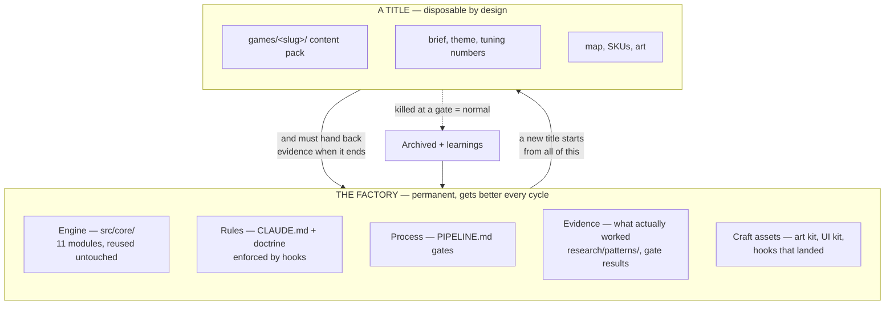
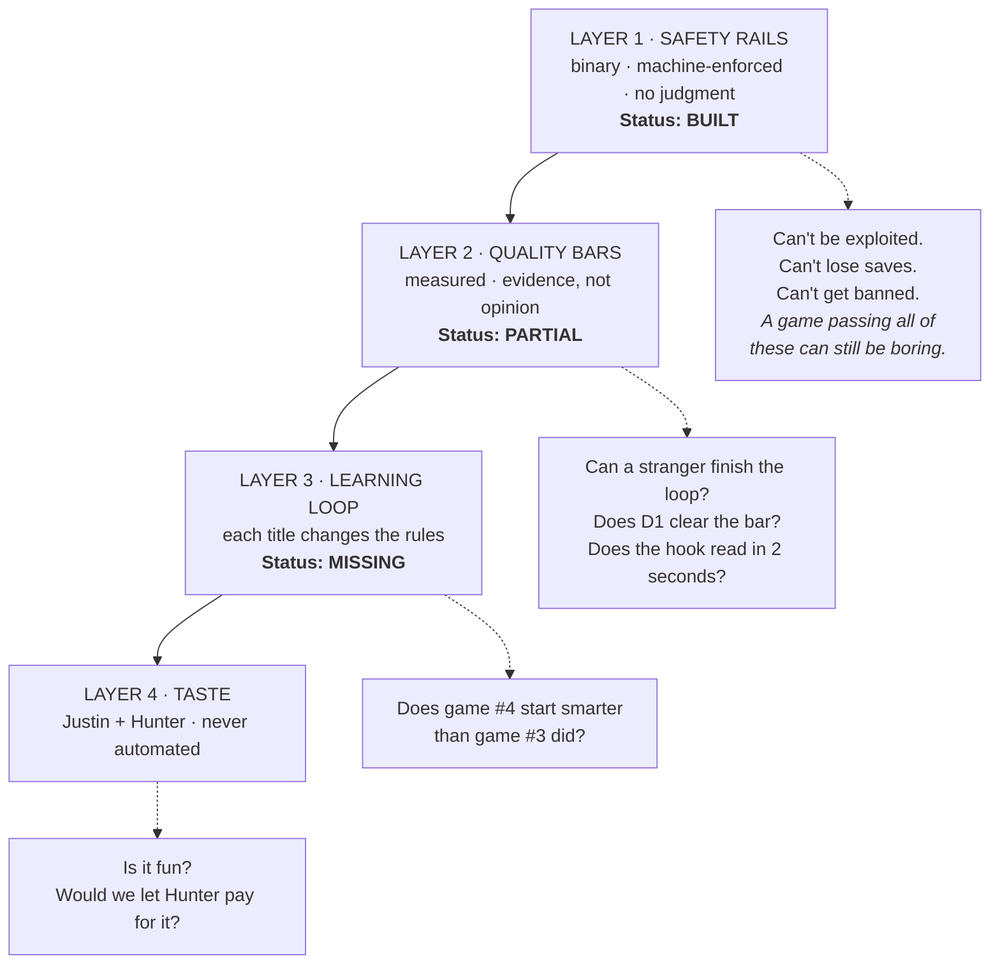
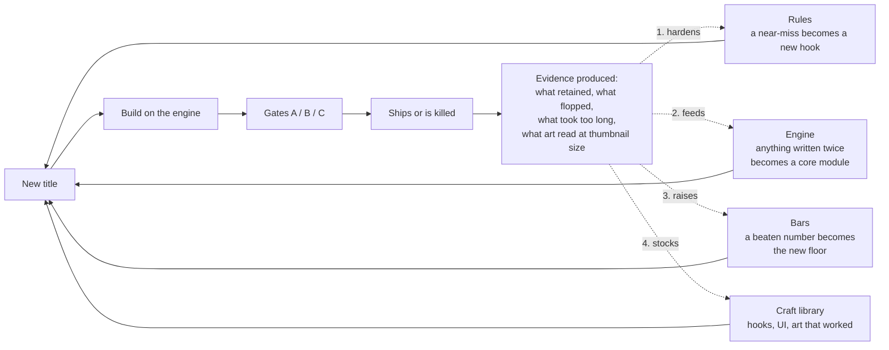

# System Architecture — the factory that makes many games

> **Governed by `docs/ROBLOX_SUCCESS_LOGIC.md` (standing orders).** If this file fights that file, that file wins.

**What this file is:** the top-level view. Not how one game gets built — that is `PIPELINE.md`. Not what makes a game worth building — that is `ROBLOX_SUCCESS_LOGIC.md`. Not how the code is split — that is `GAME_FACTORY.md`. Not the pipeline diagrams — those are `SYSTEM-MAP.md`.

**This file answers one question those four do not:** *across many titles over many months, what gets permanently better, and by what mechanism?*

Written for a non-programmer owner. Nothing below requires reading code.

---

## 1 · The thing being built is a factory, not a game

A title is disposable. Most will be killed at a gate — that is the design, not a failure. What must never be disposable is everything the title leaves behind.

**The rule this implies:** a title is not finished when it ships or when it dies. It is finished when it has handed something back. A title that taught the factory nothing was a wasted cycle even if it made money.

---

## 2 · Four layers of control, and who owns each

Everything that keeps quality up is one of four kinds of thing. They are not interchangeable, and the common mistake is trying to solve a higher layer with a lower one.

| Layer | What it is | Who enforces | Where it lives |
|---|---|---|---|
| 1 · Safety | 6 rules that refuse a write | `.claude/hooks/` + git pre-commit | Automatic, every session, every title |
| 2 · Quality | Numbers a build must hit | Gates A/B/C | Doctrine §5 — **Gate A has no numbers yet** |
| 3 · Learning | Finished titles rewrite the rules | Nothing yet | **Does not exist** |
| 4 · Taste | Is it actually good | You and Hunter, 10 minutes | G3 fun-check |

**Why the order matters.** Rules constrain; they never create. A hundred safety rules produce a hundred safe, boring games. Layers 1–3 exist to make Layer 4 cheap and fast — to get a playable thing in front of real people quickly and tell you the truth about it. They are not a substitute for taste and cannot become one.

---

## 3 · The compounding loop — the missing centre

This is the mechanism that makes the system get better instead of just repeat. Today the dotted arrows do not exist: every title ends, a learnings doc is written, and nothing reads it.

**The four returns, concretely:**

1. **Rules harden.** Something went wrong that no rule caught → it becomes a rule. If it can be spotted in a diff, it becomes a hook; otherwise a gate question.
2. **Engine grows.** Anything written for the second time stops being per-game and moves into `src/core/`. That is already the stated law in `GAME_FACTORY.md` §1; this is where it gets checked.
3. **Bars rise.** Gate numbers are a floor, not a target. A title that clears D1 by a wide margin resets the floor for the next one. A system with fixed bars stops improving the day it first passes them.
4. **Craft accumulates.** The hook that landed, the UI that read clearly, the thumbnail that got clicked — these belong in a library, not in one dead title's folder.

**The one artifact that makes this real:** a per-title closeout that is *required* and *structured*, so the next title can read it mechanically instead of someone remembering. Proposed as `docs/runs/CLOSEOUT-<slug>.md`, with a standing rule that no new title starts until the previous one has one.

---

## 4 · What carries between games — the asset ledger

For many titles, the question is always "does this belong to the game or to the factory?" Default answer: **the factory**, unless it is a name, a number, or a picture.

| Asset | Belongs to | Lives in | Updated by |
|---|---|---|---|
| Engine modules | Factory | `src/core/` | Second use of anything per-game |
| Safety rules | Factory | `.claude/hooks/rbx_guard.py` | Any incident a rule missed |
| Gate bars | Factory | `ROBLOX_SUCCESS_LOGIC.md` §5 | A title that beats a bar |
| Genre + clone-wave research | Factory | `research/` dated drops | Each research sprint |
| Mechanic teardowns | Factory | `research/patterns/` | Anything worth copying the shape of |
| Hooks that landed | Factory | **needs a home** | Closeout doc |
| Art / UI kit, style rules | Factory | **needs a home** (`art/` is WIP only) | G4 approvals |
| Brief, theme, tuning numbers | Title | `games/<slug>/` | That title only |
| Map, SKUs, icon, thumbnail | Title | `games/<slug>/` | That title only |

Two rows say **needs a home**. Those are the concrete next builds.

---

## 5 · The gap list, in build order

| # | Gap | Why it matters for many games | Size |
|---|---|---|---|
| 1 | **Gate A has no numbers** | It is the gate that fires on *every* build. Gate B has hard bars (D1 ≥12%, etc.); Gate A is a prose stop-and-patch list, so "is the slice good" is re-argued every title | Small |
| 2 | **No closeout artifact** | Without it, Layer 3 cannot exist and titles teach nothing | Small |
| 3 | **No visual quality bar** | Project goal says visually professional. `GrokBDownloads/` accepts art with nothing to clear | Medium |
| 4 | **No hook / craft library** | The best thing a dead title produces currently dies with it | Medium |
| 5 | **Title registry** | With many games there is no single list of what exists, its state, and its numbers | Small |

---

## 6 · One open decision for Justin

The doctrine says **one active title at a time** (`ROBLOX_SUCCESS_LOGIC.md`, idea-intake). "Many games" is fully compatible with that if it means *sequentially* — a portfolio built one at a time. It is not compatible if it means several titles in flight at once.

Sequential is the recommendation and the doctrine's existing position: two half-built games lose to one finished one, and the factory only compounds when a title actually reaches a closeout. **Confirm or change — this file assumes sequential.**
