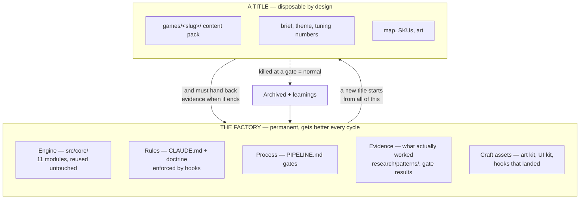
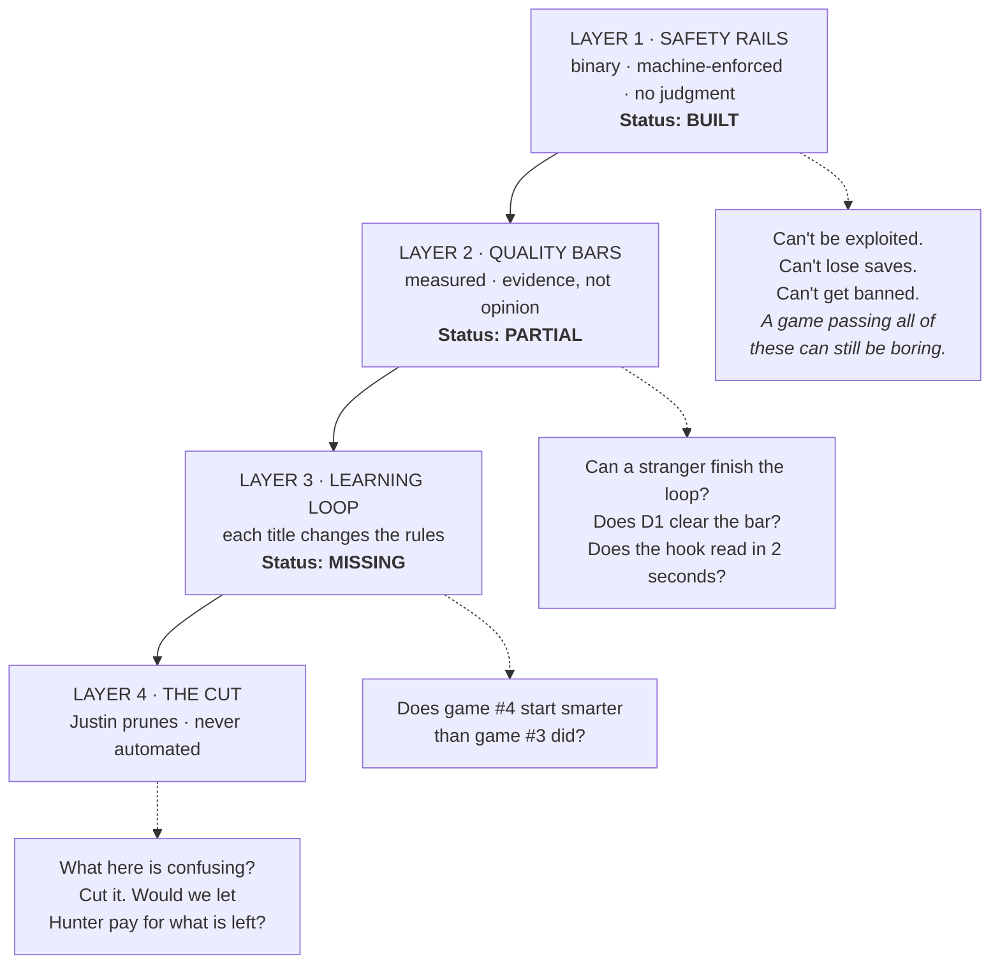
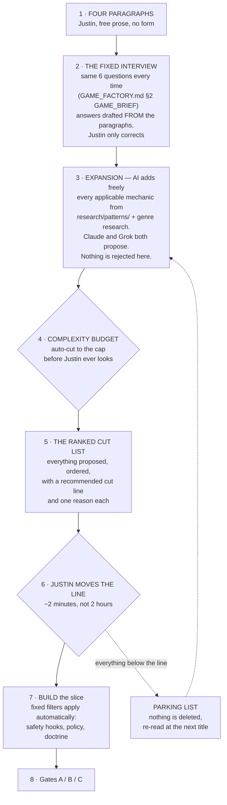
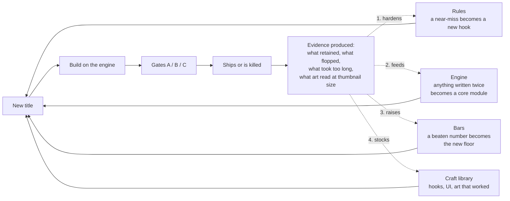

# System Architecture — the factory that makes many games

> **Governed by `docs/ROBLOX_SUCCESS_LOGIC.md` (standing orders).** If this file fights that file, that file wins.

**What this file is:** the top-level view. Not how one game gets built — that is `PIPELINE.md`. Not what makes a game worth building — that is `ROBLOX_SUCCESS_LOGIC.md`. Not how the code is split — that is `GAME_FACTORY.md`. Not the pipeline diagrams — those are `SYSTEM-MAP.md`.

**This file answers one question those four do not:** *across many titles over many months, what gets permanently better, and by what mechanism?*

Written for a non-programmer owner. Nothing below requires reading code.

---

## 1 · The thing being built is a factory, not a game

A title is disposable. Most will be killed at a gate — that is the design, not a failure. What must never be disposable is everything the title leaves behind.

**The rule this implies:** a title is not finished when it ships or when it dies. It is finished when it has handed something back. A title that taught the factory nothing was a wasted cycle even if it made money.

---

## 2 · Four layers of control, and who owns each

Everything that keeps quality up is one of four kinds of thing. They are not interchangeable, and the common mistake is trying to solve a higher layer with a lower one.

| Layer | What it is | Who enforces | Where it lives |
|---|---|---|---|
| 1 · Safety | 6 rules that refuse a write | `.claude/hooks/` + git pre-commit | Automatic, every session, every title |
| 2 · Quality | Numbers a build must hit | Gates A/B/C | Doctrine §5 — **Gate A has no numbers yet** |
| 3 · Learning | Finished titles rewrite the rules | Nothing yet | **Does not exist** |
| 4 · The cut | What is confusing gets removed | Justin, from a ranked list | G3, plus the prune step in §3 |

**Why the order matters.** Layers 1–3 exist to make Layer 4 cheap and fast. Layer 4 is not "invent the fun" — it is **remove what confuses**. That division is deliberate and it is the whole operating model of this factory:

> **The AI proposes everything applicable. Justin removes what is confusing. Neither role is the other one's job.**

Generative taste (inventing a mechanic from nothing) is not required of the owner and is not asked for. Subtractive taste is, and it is the scarcer skill: almost anyone can add a feature, and almost nobody cuts one. **The owner is supplying taste — just the half that actually decides whether a game is legible.**

---

## 3 · The build loop — describe, expand, prune

**The stated goal, in the owner's words:** *write four paragraphs describing a game, and have Claude and/or Grok put together a working model — asking the same questions and applying the same filters every time, so the process moves fast.*

The risk that makes this hard is not that the rules are too strict. It is the opposite. **AI's failure mode on a creative brief is bloat:** asked for a game, it adds every applicable idea, and the result is a slice nobody can read. A game does not usually die of being too plain; it dies of the player not understanding what to do in the first fifteen seconds.

So the loop has an expansion step *and* a forced contraction step. Neither is optional.

### The complexity budget — the anti-confusion filter

This is the piece that does not exist yet and is the actual answer to "AI can confuse a process." It is a number, not a judgment, so it applies identically every time without anyone remembering to.

| Slot | First slice allows | Rule |
|---|---|---|
| Core verb | **exactly 1** | The one thing the player does second to second |
| Return hook | **exactly 1** | Doctrine §4.5 — one, implemented well |
| Social / clip hook | **at most 1** | The thing a 12-year-old films |
| Player-facing systems | **at most 4 total** | Shop, upgrade, zone, collection… count them |
| On-screen numbers | **at most 3** | A fourth counter is where the HUD stops being readable |
| Things explained by text | **0** | If it needs a tutorial popup, it is not legible yet |

Anything the expansion produced beyond these caps is **not discarded** — it goes to the parking list and is re-read at the next title. That is what lets the AI propose freely without the slice getting worse.

### Why this makes it faster, not slower

The same questions every time means no re-deciding what to ask. The same filters every time means no re-arguing the non-negotiables. The budget means the cut is mostly already made before Justin opens it — his job becomes *move the line, or veto one item*, which is a two-minute decision instead of an open-ended design review.

**Status: the fixed interview already exists** (`GAME_FACTORY.md` §2, six questions). What is missing is the four-paragraphs-to-answers step, the expansion inventory (needs `research/patterns/` stocked), the budget, and the ranked cut list.

---

## 4 · The compounding loop — the missing centre

This is the mechanism that makes the system get better instead of just repeat. Today the dotted arrows do not exist: every title ends, a learnings doc is written, and nothing reads it.

**The four returns, concretely:**

1. **Rules harden.** Something went wrong that no rule caught → it becomes a rule. If it can be spotted in a diff, it becomes a hook; otherwise a gate question.
2. **Engine grows.** Anything written for the second time stops being per-game and moves into `src/core/`. That is already the stated law in `GAME_FACTORY.md` §1; this is where it gets checked.
3. **Bars rise.** Gate numbers are a floor, not a target. A title that clears D1 by a wide margin resets the floor for the next one. A system with fixed bars stops improving the day it first passes them.
4. **Craft accumulates.** The hook that landed, the UI that read clearly, the thumbnail that got clicked — these belong in a library, not in one dead title's folder.

**The one artifact that makes this real:** a per-title closeout that is *required* and *structured*, so the next title can read it mechanically instead of someone remembering. Proposed as `docs/runs/CLOSEOUT-<slug>.md`, with a standing rule that no new title starts until the previous one has one.

### The constraint that shapes all of this

**Claude does not persist between sessions.** A session ends and everything it worked out is gone. So "Claude learns from it" can only ever mean one thing mechanically:

> The session writes what it learned into the folder, and the next session is **forced** to read it.

Not "should read it" — forced. That is why the SessionStart hook exists and why it loads `docs/runs/STATE.md` automatically. Memory that depends on someone remembering to look is not memory.

This gives the loop three moving parts, two of which do not exist yet.

| # | Mechanism | What it does | Status |
|---|---|---|---|
| 1 | **SessionStart load** | Every session begins holding the standing orders + current state | **Built** |
| 2 | **Closeout (pull)** | A title cannot end without a structured doc the next title reads | Missing |
| 3 | **Scheduled research (push)** | A recurring task goes and gets information unprompted — genre drift, policy changes, what is winning now — and writes dated drops, updates `research/patterns/`, and flags anything that contradicts the doctrine | Missing |
| 4 | **Session close hook** | A session cannot end without recording what changed and why | Missing |

### The autonomy contract — what Claude may change without asking

"Make changes on your own" needs a boundary, or it collides with the gates. The line is **reversibility**: anything that can be read, argued with, and undone is autonomous. Anything that spends money, ships to players, or changes what the factory is aiming at is not.

| Claude changes on its own | Claude proposes, Justin decides |
|---|---|
| Add a hook rule after an incident a rule missed | Remove or weaken an existing rule |
| Raise a gate bar that a title beat | Lower a gate bar |
| Move twice-written code into `src/core/` | Kill or switch the active title |
| Write dated research drops + pattern teardowns | Promote an idea to the active title |
| Write the closeout and update `STATE.md` | Publish, or create any paid product (G5) |
| Correct a factual claim in a doc that went stale | Change a core doctrine position |
| Log an idea to `IDEA_LOG.md` | Anything that spends money |

**Every autonomous change is appended to `docs/runs/CHANGELOG.md` with the evidence that caused it.** Append-only, never rewritten. That file is how Justin audits a system that is changing itself — without having to be in the room when it does.

**The failure this prevents:** a system that quietly drifts. If Claude can rewrite the rules and nothing records why, then in four titles' time nobody — including Claude — knows what the rules are supposed to be or which of them were ever tested.

---

## 5 · What carries between games — the asset ledger

For many titles, the question is always "does this belong to the game or to the factory?" Default answer: **the factory**, unless it is a name, a number, or a picture.

| Asset | Belongs to | Lives in | Updated by |
|---|---|---|---|
| Engine modules | Factory | `src/core/` | Second use of anything per-game |
| Safety rules | Factory | `.claude/hooks/rbx_guard.py` | Any incident a rule missed |
| Gate bars | Factory | `ROBLOX_SUCCESS_LOGIC.md` §5 | A title that beats a bar |
| Genre + clone-wave research | Factory | `research/` dated drops | Each research sprint |
| Mechanic teardowns | Factory | `research/patterns/` | Anything worth copying the shape of |
| Hooks that landed | Factory | **needs a home** | Closeout doc |
| Art / UI kit, style rules | Factory | **needs a home** (`art/` is WIP only) | G4 approvals |
| Brief, theme, tuning numbers | Title | `games/<slug>/` | That title only |
| Map, SKUs, icon, thumbnail | Title | `games/<slug>/` | That title only |

Two rows say **needs a home**. Those are the concrete next builds.

---

## 6 · The gap list, in build order

| # | Gap | Why it matters for many games | Size |
|---|---|---|---|
| 0 | **The build loop of §3** — paragraphs→brief, expansion inventory, complexity budget, ranked cut list | This is the owner's stated purpose for the whole project. Everything else is support | Medium |
| 1 | **Gate A has no numbers** | It is the gate that fires on *every* build. Gate B has hard bars (D1 ≥12%, etc.); Gate A is a prose stop-and-patch list, so "is the slice good" is re-argued every title | Small |
| 2 | **No closeout artifact + no changelog** | Without them Layer 3 cannot exist: titles teach nothing and self-changes are unauditable | Small |
| 2b | **No scheduled research task** | "Get information on your own" needs a recurring job that runs without being asked | Small |
| 3 | **No visual quality bar** | Project goal says visually professional. `GrokBDownloads/` accepts art with nothing to clear | Medium |
| 4 | **No hook / craft library** | The best thing a dead title produces currently dies with it | Medium |
| 5 | **Title registry** | With many games there is no single list of what exists, its state, and its numbers | Small |

---

## 7 · One open decision for Justin

The doctrine says **one active title at a time** (`ROBLOX_SUCCESS_LOGIC.md`, idea-intake). "Many games" is fully compatible with that if it means *sequentially* — a portfolio built one at a time. It is not compatible if it means several titles in flight at once.

Sequential is the recommendation and the doctrine's existing position: two half-built games lose to one finished one, and the factory only compounds when a title actually reaches a closeout. **Confirm or change — this file assumes sequential.**
