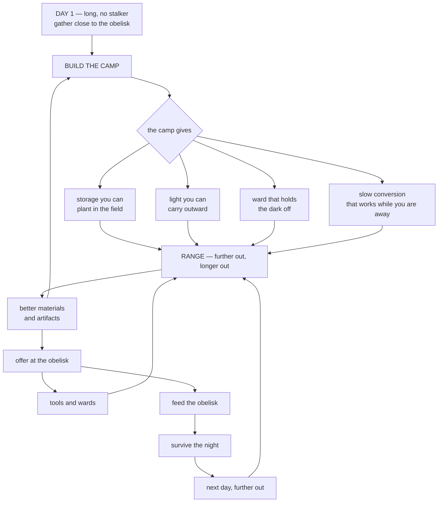

# The camp loop — Hell Week's missing day one

> Written from one sentence a ten-year-old said after playing 99 Nights for about forty minutes:
> **"he enjoys building his camp up on day one, so he can later explore."**
>
> That is a player describing the game's real structure better than any teardown did. Everything
> below is built on it.

## What that sentence actually says

Three claims are hiding in it, and each one is a design instruction.

| What he said | What it means |
|---|---|
| *building his camp up* | The camp is something you **make**, not something you are given |
| *on day one* | Day one has a **different job** from every other day |
| *so he can later explore* | The camp is not a reward. It is a **range extender** |

The third is the load-bearing one. **A camp piece earns its place only if it lets you go further out
or stay out longer.** Anything that does not do that is furniture, and furniture is a Pass 2 problem.

## What Hell Week has today, and why day two never arrives

Our current loop is a flat circle:

```
gather → offer at the obelisk → receive items → feed the obelisk → survive the night → repeat
```

Every lap is the same size. Day 7 is played at the same radius as day 1, with the same carry cap,
against a bigger number. Nothing the player makes persists, so there is no reason for day 1 to feel
different from day 6 and no sense of a base to come home to.

That is the thing the sentence diagnoses. **Surviving day one has to buy you something that changes
day two**, and right now it buys a larger burn rate.

## The loop we want



Read the two cycles in that graph:

- **The inner cycle is the camp.** Materials become camp, camp becomes range, range becomes better
  materials. It compounds and it is the reason to play carefully.
- **The outer cycle is the obelisk.** Materials become offerings, offerings become fuel and tools,
  fuel survives the night. It is the clock and it does not compound.

Today Hell Week only has the outer one. **The inner cycle is the whole missing game.**

## The division of labour: obelisk versus camp

The obelisk is already the workbench, the beacon and the win condition. The camp must not duplicate
it, or the player has two places that do the same job and neither feels like home.

| | **The obelisk** | **The camp** |
|---|---|---|
| What it is | Given, fixed, at the centre | Made, placed, anywhere |
| What it does | Crafts by offering. Counts the days. Ends the run | Extends how far and how long you can go |
| Currency | Offerings in, better things out | Materials in, capability out |
| Fails how | It goes out and the run ends | It gets overrun and you fall back |

**Craft at the obelisk. Survive by the camp.**

## The camp pieces, each justified by range

Every piece answers a specific reason you currently have to turn around and walk home.

| Piece | The problem it solves | Effect |
|---|---|---|
| **Cache** | *I can only carry five things* | A planted drop point. Store and retrieve away from the obelisk |
| **Brazier** | *I cannot see out there* | A small permanent light. A second safe island |
| **Ward stake** | *the stalker is between me and home* | Pushes the stalker back in a radius around it |
| **Drying rack** | *raw material is dead weight* | Converts raw to useful **over time, while you are elsewhere** |
| **Salt line** | *I do not know where safe ends* | A drawn boundary on the ground. Readable at noon and midnight |

The drying rack is the sleeper. It makes **time away from camp productive**, which is the only piece
that gives you a reason to come back that is not fear.

The salt line is the cheapest and it is also the single readability fix carried over from watching
99 Nights: they draw the safe zone on the ground, and we draw nothing.

## Day one gets a different job

| | Now | Proposed |
|---|---|---|
| Length | 100 s, same as every day | **Several times longer** |
| Stalker | `watch`, does not hunt | unchanged, this part we got right |
| Obelisk burn | Normal | **Zero or near zero.** The clock does not start until you leave |
| What you are doing | The same loop as day 6 | **Building**, close in, with no pressure |
| What it buys you | A bigger burn rate | **A camp, and therefore a radius** |

This is the single biggest onboarding change available and it is mostly numbers.

## Life in the hellscape: three tiers, and only one of them can be killed

The desert currently has nothing alive in it. That is the real gap behind the earlier question about
weapons, and it is why "weapons" felt unanswerable.

| Tier | What | Can you kill it? | Why it exists |
|---|---|---|---|
| **Prey with teeth** | **Scorpion** | **Yes**, with a held tool | Gives the desert life, drops building material, makes the tool matter |
| **The threat** | The stalker | **Never** | If it can die, the night stops being a clock |
| **The dark** | Ambient | n/a | The pressure everything else hangs on |

### The scorpion
Big yellow eyes, and the eyes are the point. **You see the eyes before you see the scorpion**, which
is only possible because our night is navy rather than black. Two glowing points low to the ground at
forty studs is a complete sentence: something is there, it is small, and it has noticed you.

- Roams day and night. Faster and bolder at night
- Killable with any held tool, takes several hits, hurts if ignored
- Drops **chitin** for building and **venom** for offering
- It is prey, not a boss. It never threatens the run, only the trip

## The assumptions I am building on

These are choices made without evidence. Each is a thing Gate A should be pointed at, and each is
cheap to reverse if it is wrong.

| # | Assumption | If it is wrong |
|---|---|---|
| A1 | A player will build without being told to, if the materials are in hand and the pieces are cheap | Day 1 becomes empty and confusing. Needs a prompt on the first piece |
| A2 | Range extension is felt as a reward, not as chores | Building feels like homework. Pieces need to be fewer and stronger |
| A3 | A drop point away from home is understood without explanation | Nobody plants a cache. Fold storage into the brazier so one piece does both |
| A4 | Killable prey does not make the unkillable stalker feel inconsistent | The stalker reads as a bug. Make the scorpion flee rather than fight |
| A5 | A long, pressureless day 1 reads as generous, not as boring | Testers idle. Shorten it and put the first scorpion on day 1 |
| A6 | Players will build near the obelisk rather than far from it | The camp scatters and the obelisk is abandoned. Gate piece placement to a radius |
| A7 | Two hauling systems, carry and drag, are learned without instruction | Nobody drags. Make the first required piece a drag-class object |

A5 and A1 are the two that decide whether any of this works. Both are answerable in one Gate A
session with three kids and no code changes beyond what is built here.

## Build order

1. **Day one restructure.** Numbers only. Longest lever, shortest work
2. **Salt line and the drawn safe ring.** Readability, and the groundwork for placed pieces
3. **The build system itself**, generic in the engine: place, drag, remove
4. **The five pieces**, in the pack
5. **The scorpion**, with the eyes
6. **Artifacts**, found far out, which is the reason range matters
