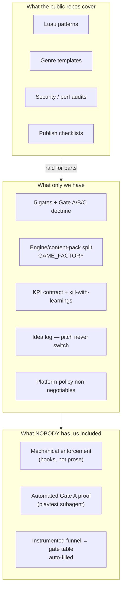
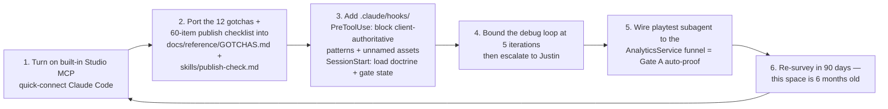

# Survey — published Claude-based scaffolding for Roblox games

> **Governed by `docs/ROBLOX_SUCCESS_LOGIC.md` (standing orders).** If this file fights that file, that file wins.

**Date:** Sept 12, 2026 · **Question asked:** does published scaffolding / rules / charts / loops already exist for building great Roblox games with Claude as the architecture?

**Short answer:** yes for the *engineering* half, no for the *business* half. Four real repos + one official Roblox MCP exist and are worth raiding for parts. Nothing published combines gates, retention economics, and kill criteria the way `ROBLOX_SUCCESS_LOGIC.md` + `GAME_FACTORY.md` already do. We are ahead on doctrine and behind on **enforcement**.

---

## 1. What exists, ranked by what it's worth to us

| Rank | Thing | What it actually is | Maturity | Worth stealing |
|---|---|---|---|---|
| 1 | **Roblox built-in Studio MCP** (official) | MCP server shipped inside Studio Assistant settings. Quick-connect toggle for Claude Code. Scripts read/edit/grep, game-tree search, instance inspect, Luau exec, asset gen (mesh/material/texture/procedural), screen capture, **simulated keyboard/mouse**, multi-Studio session mgmt, and a **`playtest` subagent** that runs gameplay scenarios and verifies outcomes | Shipped, actively developed. Replaces the archived standalone `Roblox/studio-rust-mcp-server` (archived Apr 3 2026, 480★) | **The playtest subagent.** Automated Gate A smoke test: join → first earn → first spend → first upgrade, verified without a human |
| 2 | **brockmartin/roblox-game-skill** | Router `SKILL.md` (121 lines, 18 routes) + 16 reference docs + 7 genre templates (simulator, tycoon, obby, RPG, horror, BR, universal) + 7 workflows | Young — 3 commits | **The bounded loops and lists:** debug loop capped at 5 iterations, 60+ item publish checklist across 10 categories, security audit (remote validation / client trust), perf audit, **12 severity-rated gotchas** (DataStore loss, memory leaks) |
| 3 | **CodePhobiia/claude-roblox-game-studio** | 36 agents in 3 tiers (3 directors on Opus → 7 leads on Sonnet → 18 specialists), **9 hooks**, 11 path-scoped rule files, 26 templates. Protocol: Question → Options → Decision → Draft → Approval. Phases: pre-prod → production → polish → live | Full template, heavy | **The hooks and path-scoped rules.** SessionStart loads prior state + detects gaps; PreToolUse validates commits and asset naming; PostToolUse warns on protected-branch pushes; SessionStop preserves accomplishments |
| 4 | **AshExplained/roblox-skills** | 40 MIT-licensed skills in 8 groups (orchestration, architecture, gameplay, UX, economy/monetization, security, growth/live-ops, perf/QA). Loop: *spec → slice → build one piece → playtest → repeat*. `roblox-triage` moves work through a state machine; setup injects routing into your `CLAUDE.md` | 6★, MIT, thin adoption | **The triage state machine** — only fully-specified, playtestable work is allowed to advance |
| 5 | **Chrrxs/robloxstudio-mcp** | Maintained fork of boshyxd's (485★, archived June 2026). 43 tools; read-only inspector edition has 31 | Fork is the live one | Backup only — the official built-in MCP covers this |
| — | claudeskills.info `gamedev` plugin (66 skills) | Roblox appears only inside an "other-engines" grab-bag with Bevy/pygame/LÖVE | Broad, shallow on Roblox | Nothing |
| — | StudioWizz/Claude-Rbx, Claudeblox, CyanoTex/Roblox-Claude-Code-Skills | Small library repos; CyanoTex 404s now | Unmaintained | Nothing |

---

## 2. The honest gap analysis

Everything published is a **knowledge library**: "here is how to write a DataStore, here is a tycoon template." Nobody has published what we already wrote — a doctrine that says *when to stop*, *what proves a game is worth money*, and *what kills a title*.

**The position I'm holding:** our rules are better than theirs and enforced worse. `CLAUDE.md` says "never trust the client" and "ProcessReceipt must be idempotent" — that is prose a session can drift past at hour three. CodePhobiia's setup makes the equivalent rules *fire on tool use*. That is the single highest-value thing in this entire survey, and it is not a Roblox insight at all — it is a Claude Code insight.

---

## 3. The adoption loop (what to actually do)

**Explicitly not adopting:** CodePhobiia's 36-agent hierarchy. Three tiers of agents asking each other permission burns tokens and directly violates our "Claude is the **only** writer to `src/` and the live DataModel" rule. One-person studio, one writer. Take their hooks, leave their org chart.

**Also not adopting:** AshExplained's `setup-roblox-skills` injecting routing into `CLAUDE.md`. Our `CLAUDE.md` is hand-governed and points at the doctrine; an installer rewriting it is a second source of truth by the back door.

---

## 4. Re-check date

This whole category is ~6 months old. Roblox archived two MCP servers inside 2026 and moved MCP into Studio itself. **Re-run this survey by Dec 12, 2026** before relying on any row above.

## Sources

- https://create.roblox.com/docs/studio/mcp
- https://github.com/Roblox/studio-rust-mcp-server
- https://github.com/brockmartin/roblox-game-skill
- https://github.com/CodePhobiia/claude-roblox-game-studio
- https://github.com/AshExplained/roblox-skills
- https://github.com/boshyxd/robloxstudio-mcp (→ https://github.com/Chrrxs/robloxstudio-mcp)
- https://claudeskills.info/plugins/category/game-development/
