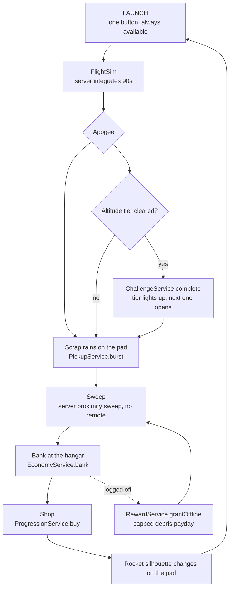

# Spec — SPACEHEX — Pass 1 slice

> Governed by `docs/ROBLOX_SUCCESS_LOGIC.md` (standing orders). If this file fights that file, that file wins.
> **Status: ACTIVE. Promoted by Justin 2026-09-20. `games/spacehex/` exists and is mounted.** Hell Week is parked.
>
> **SUPERSEDED IN PART, 2026-09-20 (same session).** Justin revised the design after this
> spec was written: the game is now *start with $1,000,000 → buy parts in a warehouse →
> assemble a rocket → roll it to the pad → launch → earn on performance → upgrade →
> repeat*, with the space station as the first goal and the Moon after it. That replaces
> §1's debris-sweep loop and §5's sweepbank mapping. **The current design of record is
> `games/spacehex/brief.md` + `games/spacehex/PARTS.md` + `games/spacehex/economy.md`.**
> §2 (comps verdict), §3 (the tier ladder), §6 (graphics) and §8 (threat model) all still
> hold and are unchanged.
> Doctrine check: this spec touches first session, D1 and the one daily reason to return, and is written during a window where the Active title is blocked on Justin's two clicks. It spends no build session.

Slug: `spacehex` · Loop family for Pass 1: **`sweepbank`** (existing) · Comps board: `research/2026-09-20-space-rocket-comps.md`

---

## 1. The design in one page

The research verdict (`research/2026-09-20-space-rocket-comps.md` §2) is that a launch is a novelty verb and novelty verbs die. So the launch is not the loop. **The launch is what triggers the loop.**

```
You press LAUNCH. The rocket climbs. The altitude number climbs with it.
Somewhere it runs out of fuel and falls back.
It comes apart on the way down and rains scrap across the pad.
You sweep the scrap up. You carry it to the hangar. You sell it.
You bolt a bigger engine on. The rocket is visibly taller.
You press LAUNCH.
```

That is the engine's existing **sweep-and-bank loop** with the launch in place of the coin flood. `LoopService` already does flood → collect → bank → shop → upgrade. The debris field *is* the flood. This is why Pass 1 costs almost no new engine code.

The real science is not a physics lesson bolted on top. It is the **reason the number changes**, and it is visible on the pad:

- More fuel is more Δv **and** more mass. The rocket that carries everything does not leave the ground.
- Thrust-to-weight under 1.0 and it never lifts. The player sees the clamps hold and the engine scream. Nobody has to explain it.
- Payload is what you are *paid* for at altitude, and it is the thing that makes you slower.

Every one of those is a trade the player feels in the apogee number within 90 seconds.

### The five-minute arc

| t | What happens |
|---|---|
| 0:00 | Spawn on the pad. A small finished rocket is already standing there. One button: **LAUNCH**. No build screen. |
| 0:05 | It flies. Altitude counter. It reaches ~2 km and tips over. |
| 0:35 | Scrap rains down across the pad apron. |
| 0:40 | Sweep it up — the bag fills. Bag-full teaches the hangar (Mine a Mountain's lesson). |
| 1:10 | Sell at the hangar. First scrap money. |
| 1:20 | Shop: **BIGGER ENGINE — 40 scrap.** Affordable on the first trip. The rocket on the pad visibly changes. |
| 1:40 | Second launch. **4.1 km.** The number moved because you changed a part. That is the hook. |
| 3:00 | Third or fourth launch clears **10 km** → *"UPPER ATMOSPHERE"* banner, tier 1 of 6 lights up on the mission board. |
| 5:00 | The board shows the ladder all the way to the Moon. You know exactly what you are playing for. |

### Return hook (Pass 1 has exactly one)

**Offline recovery.** Debris keeps falling while you are gone. `RewardService.grantOffline` already exists, is capped, and is never punished — log in, the pad is littered, you sweep a payday. One mechanic, implemented well (doctrine §4.5).

The Moon base and its offline production are **Wave 5**, not Pass 1. Cut line honoured.

---

## 2. Loop diagram



## 3. The altitude ladder — `ChallengeService` worlds

Six tiers. `ChallengeService` already runs `locked → open → mastered`, persists per player, and auto-opens the next tier. Tiers are `World` entries; the tasks inside a tier are its `challenges`.

| # | Tier | Gate (apogee / condition) | Opens |
|---|---|---|---|
| 1 | Upper Atmosphere | 10 km | tank tier 2 |
| 2 | **Kármán Line** — "you are officially in space" | 100 km | payload bay |
| 3 | Low Earth Orbit | 400 km **and** horizontal velocity held | telemetry ladder |
| 4 | Station Rendezvous | dock within tolerance | recovery/reuse (stages refund) |
| 5 | Trans-Lunar Injection | escape burn inside the window | Moon transfer |
| 6 | **Moon Landing** | touchdown under 3 m/s | the Moon base (Wave 5) |

Each tier carries 3–5 named tasks (`{id, label, hint}`) — "reach 10 km with payload aboard", "land the booster intact", "keep TWR above 1.2 off the pad". These are the walkthrough. The onboarding agent requirement (doctrine, every game must teach itself to a 10-year-old) is satisfied by the mission board, not a tutorial wall.

---

## 4. The flight model — real science, one screen of it

Server-side deterministic integration, **not Roblox physics**. The client renders a transform it is sent; it never reports altitude. (R1/R2 clean by construction: there is no flight remote at all — `C2S_Act` carries the verb `launch`, the server does the rest.)

```
mass(t)      = dryMass + fuelMass(t) + payloadMass
thrust       = Σ engine.thrust                       (engines from the part ladder)
burnRate     = thrust / (Isp * g0)                   -- Isp is the engine's efficiency stat
TWR(t)       = thrust / (mass(t) * g)                -- < 1.0 off the pad = it does not fly
rho(h)       = RHO0 * exp(-h / SCALE_H)              -- exponential atmosphere
drag(t)      = 0.5 * rho(h) * v^2 * Cd * area
a(t)         = (thrust - drag - mass*g) / mass
deltaV       = Isp * g0 * ln(m0 / mDry)              -- Tsiolkovsky. THE number on the pad card.
```

Constants live in the pack, not the engine:
`g = 9.81`, `g0 = 9.81`, `RHO0 = 1.225`, `SCALE_H = 8500 m`, `WORLD_SCALE = 1 stud : 0.28 m` for the visible first 2 km, above which the camera switches to a scaled tracking view and altitude is reported in km. Step at a fixed `dt = 1/30` server-side, 90 s hard cap per flight.

**The pad card** — the readable version of the same maths, shown before every launch:

```
  THRUST      420 kN      ███████░░░
  WEIGHT      310 kN      █████░░░░░
  LIFT-OFF    1.35 : 1    ✅  it will fly
  Δv          2,140 m/s   →  est. apogee  11.4 km
  PAYLOAD     0 kg        (empty bay — no bonus)
```

Two bars and a ratio. A 10-year-old reads "green means it goes up". An adult reads Tsiolkovsky. Same card.

### The part ladder → `ProgressionService.UpgradeDef`

Existing contract, no engine change: `{id, label, blurb, maxLevel, baseCost, costGrowth, base, perLevel}`. Cost is geometric; effect is `base + perLevel*(level-1)`.

| id | label | what it moves | the trade it forces |
|---|---|---|---|
| `engine` | Engine | `thrust` | heavier, burns faster |
| `tank` | Fuel Tank | `fuelMass` | more Δv, worse TWR at ignition |
| `frame` | Airframe | `dryMass` ↓ | pure win, deliberately the most expensive |
| `payload` | Payload Bay | `payloadMass` capacity | pays per kg **at altitude**, costs you altitude |
| `telemetry` | Telemetry | widens the gravity-turn tolerance window | the only upgrade that makes *flying* easier rather than the rocket stronger |
| `recovery` | Recovery Chutes | % of stage mass refunded as scrap | turns a launch into a smaller loss |

`tools/econ_sim.py` already parses this exact contract by slug and runs 300 Monte-Carlo sessions against the engine's own formulas. **Run it before a single number ships** — it caught the Fat Man economy dying on day 3 (E-0006).

---

## 5. File tree — what actually gets written

Pass 1 adds **one folder and two edited lines.** No new `src/core/` module.

```
games/spacehex/
  brief.md                  the one-pager Justin signs off
  server/
    config.luau             loop="sweepbank", roles, flood(=debris), collect,
                            offline, upgrades[6], flight{} constants, tiers
    world.luau              pad slab, apron, hangar zone (kind="bank"),
                            shop zone, pad zone (kind="payout"), spawn, lighting rig
    rocket.luau             the rocket as part-spec data, one entry per ladder level
                            (generated — see §6)
    tiers.luau              the 6 ChallengeService Worlds + their tasks
    flight.luau             the integrator + constants (pack-local for Pass 1;
                            promoted to src/core/FlightService.luau at Pass 2)
    sku.luau                DRAFT price ladder, unwired. No MarketplaceService call.
  shared/
    theme.luau              title, colours, ~25 copy keys, opening act narration
  art/
    ART.md                  the shot list
```

Then in `default.project.json`, exactly two lines:

```
  ServerScriptService.Pack  ← games/spacehex/server
  ReplicatedStorage.Pack    ← games/spacehex/shared
```

Hell Week re-mounts the same way. Nothing is lost by switching.

**R7 warning:** the moment `games/spacehex/` exists, the strings `spacehex` and `makeittospace` become BLOCK-listed inside `src/core/`. The flight integrator therefore lives in the pack for Pass 1 and, if promoted, becomes a game-agnostic `FlightService` at Pass 2.

### What is reused, unchanged

| Need | Module | Note |
|---|---|---|
| debris rain | `PickupService.burst` | already does physics-scattered collectables with a server proximity sweep |
| sweep + bag | `SackService` + `Hotbar` | hotbar icons are ViewportFrames of the real part specs — **every scrap type gets a correct icon for free, zero art** |
| sell + currency | `EconomyService` | carry/bank split, server-only, 200-entry ledger |
| the shop | `ProgressionService` + `Hud` | geometric ladder, `C2S_Buy`, rate-limited, tested UI |
| the mission board | `ChallengeService` | locked→open→mastered, persisted, un-forgeable |
| offline debris | `RewardService.grantOffline` | capped, never decayed |
| phases | `ClockService` | `prelaunch → ascent → coast → descent → recovery` as a cycle schedule |
| pad zones | `ZoneService` | polled bounds, handles discs |
| save | `DataService` | **needs a `SCHEMA_VERSION` bump + `tiers` field**; that is the only persistence change in Pass 1 |
| movement feel | `Moves` | double-jump front flip is free and genuinely good in low gravity later |
| title card | `OpeningAct` | data-driven from `theme.opening` |

### What is genuinely new

1. `flight.luau` — ~200 lines, the integrator above. The only real new code.
2. A `launch` verb added to the `C2S_Act` validator's allow-list (`pickup | action | attack | inspect | build:<id>` → add `launch`).
3. A pad card + altitude ribbon in the HUD (built on `UIKit`, ~120 lines).
4. Debris burst driven by apogee rather than by a flood timer — a parameter change in the pack, not in `LoopService`.

---

## 6. Graphics — the three paths, in cost order

Doctrine `skills/art-pipeline.md` order is first-party free → Creator Store → external gen → human.

**Path A — procedural from primitives. Works today, needs no publish, no upload, no moderation.**
`tools/gen_obelisk.py` builds an 18-stud landmark out of ~260 primitives by **slicing a silhouette finely instead of stacking blocks** — 52 thin shaft slices give a sub-pixel taper. A rocket body, a nozzle bell, a gantry and a launch clamp are exactly that technique. Fork it to `tools/gen_rocket.py`, emit one part-spec table per ladder level, and the rocket's silhouette changes when you buy a part **because the data changed**, with no art asset anywhere in the chain. `tools/gen_biome.py` is the same story for lunar regolith at Wave 5 — its `BIOMES` dict is just palettes and densities; a Moon entry is a dict entry.

**Path B — Roblox Studio MCP, first-party generators. Free, available now.**
`generate_procedural_model`, `generate_mesh`, `generate_texture`, `generate_material` — for the hero pieces only (engine bell, capsule, station module). Per `skills/studio-mcp.md`: MCP is never the home of code; anything generated is mirrored to disk as pack data the same session.

**Path C — Creator Store via `search_asset` / `insert_asset`. BLOCKED.**
`InsertService:LoadAsset` requires the place to be published with API access on — **the same single blocker that is holding Hell Week**. Search terms to stock the shelf when it unblocks: `low poly rocket`, `launch tower`, `gantry`, `moon rock`, `regolith`, `space station module`, `astronaut helmet`, plus Creator Store audio for the ignition rumble, staging thump and telemetry beep.

**2D — Grok Bots.** Icon 512×512 and thumbnail 1920×1080 readable at 200px (one face, one verb, ≤3 words); the tier badges for the mission board; the pad-card iconography. Deliverables land in `GrokBDownloads/` (inbound only) and get wired in with a spec, per `skills/art-pipeline.md`.

**The visual bet:** hard black sky, one hard white sun, no fog — and the altitude ribbon is the only warm colour on screen. At 200px the thumbnail is a small rocket, a very large empty black, and a number. Every comp on the board uses a busy blue Earth-from-space plate.

---

## 7. Build order

| Wave | Work | Attended? | Stop condition |
|---|---|---|---|
| 0 | `brief.md` + Justin signs the hook | **[A]** | one paragraph he agrees with |
| 1 | Pack skeleton: `config` / `world` / `theme`, mounts swapped, boots clean | [U] | `rojo build` green, place loads, player spawns on a pad |
| 2 | `flight.luau` + `launch` verb + altitude ribbon | [U] | one launch, one apogee number, console clean |
| 3 | Debris burst → sweep → bank → shop → visibly taller rocket | [U] | **the full loop closes once without a human in the room** |
| 4 | 6 tiers wired to `ChallengeService`; pad card; `econ_sim.py` run and the ladder tuned | [U] | sim shows no wall and no billionaire by day 7 |
| 5 | `gen_rocket.py`, lighting rig, opening act, audio IDs | [U] | the look bar's seven rows (default lighting is a fail) |
| 6 | **Gate A** — three fresh kids, Hunter operating | **[A]** | they can say the gist in three sentences and they *want another launch* |

`econ_sim.py` and the four-beat MCP playtest are the verification, per `skills/studio-mcp.md`. Note the known finding: never verify runtime state by `require`-ing an engine module over `execute_luau` — observe the DataModel.

---

## 8. Threat model

- Client never sends altitude, apogee, fuel, or scrap. It sends the verb `launch` and nothing else. The server integrates and pushes state via `StateSync`.
- Scrap is collected by the server's proximity sweep (`PickupService`), never a collect remote.
- Shop purchases go through `C2S_Buy` → `ProgressionService.buy`, priced server-side, rate-limited by `RemoteGuard`.
- No `MarketplaceService` call ships in Pass 1. `sku.luau` is a draft. `ProcessReceipt` is human-gated (R3) and is not written until after Gate B.
- All DataStore access stays inside `DataService` (R4). The schema bump is the only touch.

## 9. Out of scope for Pass 1

Moon base and offline production · multi-stage separation · docking minigame · orbital mechanics beyond a horizontal-velocity check · weekly reset event · any Robux product · multiplayer pad sharing · reentry heating.
